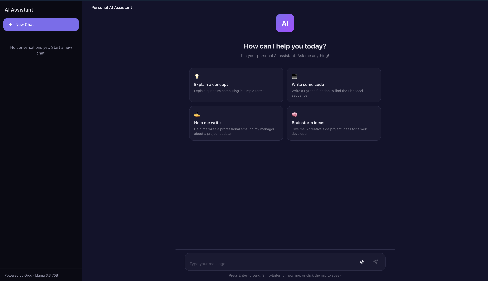

# Personal AI Assistant

A modern, ChatGPT-style personal AI assistant built with Next.js and powered by [Groq](https://groq.com/) for lightning-fast inference.

[](https://personal-assistant-vercel.vercel.app)


## Demo

**Try it live:** [personal-assistant-vercel.vercel.app](https://personal-assistant-vercel.vercel.app)

### Screenshots

| Welcome Screen | Chat in Action |
|:-:|:-:|
|  |  |

> To add screenshots, save them to `public/screenshots/` and they'll display here automatically.

## Features

- **Fast AI responses** — powered by Groq's lightning-fast inference with Llama 3.3 70B
- **Voice-to-text input** — click the mic button and speak, powered by Web Speech API
- **Conversation history** — conversations are saved in your browser's localStorage
- **Multiple conversations** — create, switch between, and delete conversations
- **Markdown rendering** — code blocks, bold, italic, headings, and lists are formatted
- **Responsive design** — works on desktop and mobile with a collapsible sidebar
- **Dark mode** — automatically matches your system preference
- **Suggestion prompts** — quick-start suggestions on the welcome screen

## Tech Stack

| Layer     | Technology                  |
|-----------|-----------------------------|
| Framework | Next.js 16 (App Router)     |
| Styling   | Tailwind CSS 4              |
| LLM       | Llama 3.3 70B via Groq API  |
| Language  | TypeScript                  |
| Hosting   | Vercel (free tier)          |

## Getting Started

### Prerequisites

- [Node.js](https://nodejs.org/) 18+ installed
- A free [Groq API key](https://console.groq.com/keys)

### Installation

1. **Clone the repository:**

   ```bash
   git clone https://github.com/Ishanbhise/personal-assistant.git
   cd personal-assistant
   ```

2. **Install dependencies:**

   ```bash
   npm install
   ```

3. **Set up environment variables:**

   ```bash
   cp .env.example .env.local
   ```

   Open `.env.local` and replace `your_groq_api_key_here` with your actual Groq API key:

   ```
   GROQ_API_KEY=gsk_your_actual_key_here
   ```

4. **Run the development server:**

   ```bash
   npm run dev
   ```

5. **Open** [http://localhost:3000](http://localhost:3000) in your browser.

## Deploy to Vercel (Free)

The easiest way to host this for free is with [Vercel](https://vercel.com):

1. Push your code to GitHub (see below)
2. Go to [vercel.com](https://vercel.com) and sign in with GitHub
3. Click **"Add New Project"** and import your repository
4. In the **Environment Variables** section, add:
   - Key: `GROQ_API_KEY`
   - Value: your Groq API key
5. Click **Deploy**

Your app will be live at `https://your-project.vercel.app` within minutes.

## Project Structure

```
src/
├── app/
│   ├── api/
│   │   └── chat/
│   │       └── route.ts        # Groq API endpoint
│   ├── globals.css              # Global styles & CSS variables
│   ├── layout.tsx               # Root layout with fonts & metadata
│   └── page.tsx                 # Main chat page (client component)
├── components/
│   ├── ChatInput.tsx            # Message input with auto-resize
│   ├── ChatMessage.tsx          # Message bubble with markdown
│   ├── Sidebar.tsx              # Conversation list sidebar
│   ├── VoiceButton.tsx          # Voice-to-text via Web Speech API
│   └── WelcomeScreen.tsx        # Landing screen with suggestions
└── lib/
    ├── storage.ts               # localStorage helpers
    └── types.ts                 # TypeScript interfaces
```

## Configuration

You can customize the AI's behavior by editing the system prompt in `src/app/api/chat/route.ts`:

```typescript
const SYSTEM_PROMPT = `You are a helpful, friendly...`;
```

To change the model, update the `model` field in the same file. Groq supports:

- `llama-3.3-70b-versatile` (default, best quality)
- `llama-3.1-8b-instant` (faster, lighter)
- `mixtral-8x7b-32768` (Mixtral)

## License

MIT — feel free to use this for your own projects.
